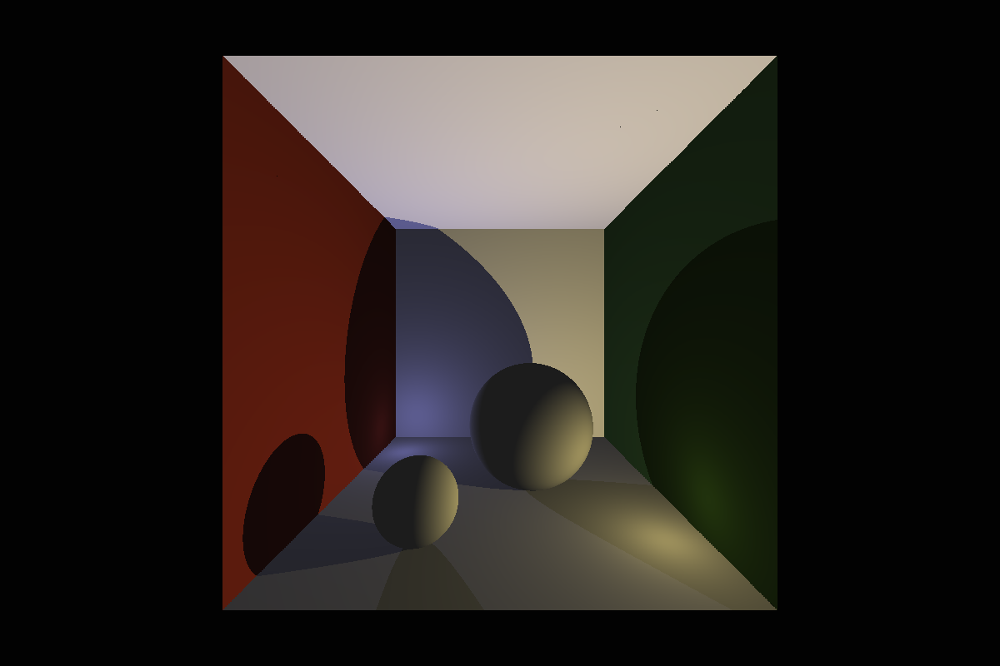

# Global illumination

https://www.youtube.com/playlist?list=PL_w_qWAQZtAYd0Kxmq17YXwqXkO1MVrqi

Whitted ray tracing

scene
```cpp
add_material((vec3f_t){1.00f, 1.00f, 1.00f}, EMISSIVE_FALSE, &scene); // 0
add_material((vec3f_t){0.56f, 0.17f, 0.11f}, EMISSIVE_FALSE, &scene); // 1
add_material((vec3f_t){0.20f, 0.34f, 0.12f}, EMISSIVE_FALSE, &scene); // 2
add_material((vec3f_t){0.80f, 0.34f, 0.12f}, EMISSIVE_FALSE, &scene); // 3
add_material((vec3f_t){1.00f, 0.00f, 0.00f}, EMISSIVE_TRUE, &scene);  // 4
add_light((vec3f_t){1.00f, 0.90f, 0.50f}, (point_t){ 0.4f, -0.4f,  0.3f}, &scene);
add_light((vec3f_t){0.50f, 0.50f, 0.90f}, (point_t){-0.4f, -0.4f, -0.3f}, &scene);

add_sphere((point_t){-0.2f, -0.4f, 0.3f}, 0.1f, 0, &scene); // 0
add_sphere((point_t){ 0.1f, -0.3f, 0.0f}, 0.2f, 0, &scene); // 1
add_triangle(face_0, 0, &scene); // 2
add_triangle(face_1, 0, &scene); // 3
add_triangle(face_2, 2, &scene); // 4
add_triangle(face_3, 2, &scene); // 5
add_triangle(face_4, 1, &scene); // 6
add_triangle(face_5, 1, &scene); // 7
add_triangle(face_6, 0, &scene); // 8
add_triangle(face_7, 0, &scene); // 9
add_triangle(face_8, 0, &scene); // 10
add_triangle(face_9, 0, &scene); // 11
```

